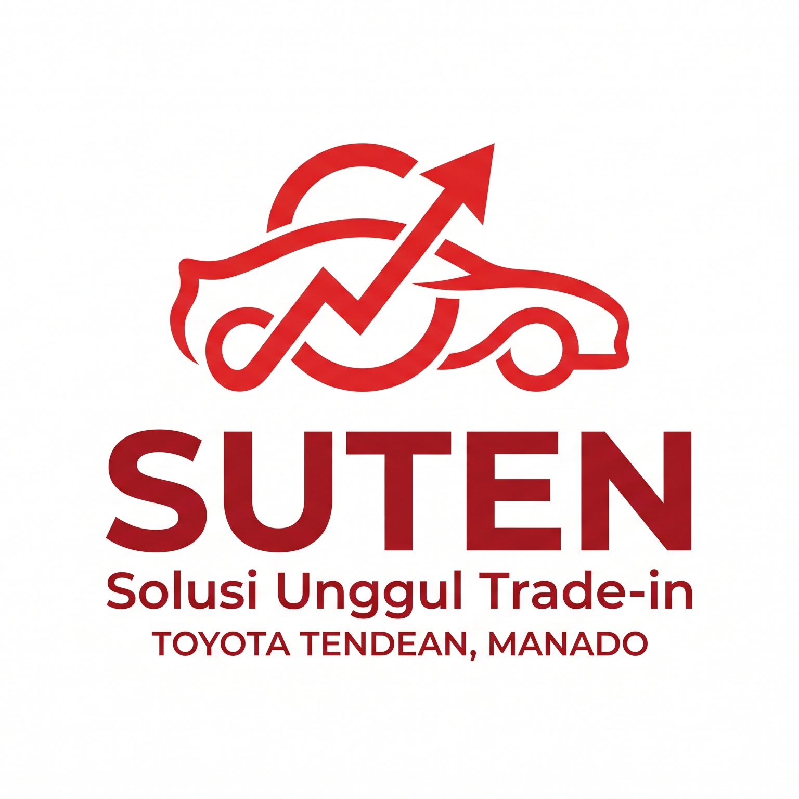

<div align="center">



# SUTEN

### Dulu ditaksir. Sekarang menaksir.

**Platform Taksasi Mandiri & Trade-In Kendaraan**
Hasjrat Toyota Tendean — Manado

<br />


</div>

---

## Tentang SUTEN

**SUTEN** adalah platform *self-appraisal* yang memungkinkan pemilik kendaraan menaksir sendiri harga mobilnya langsung dari ponsel — tanpa perlu datang ke dealer terlebih dahulu.

Berbeda dengan kalkulator harga pada umumnya yang hanya menampilkan satu angka, SUTEN menunjukkan **dari mana angka itu berasal**: rincian nilai per komponen, alasan setiap pengurangan, serta **berapa nilai kendaraan dapat naik** apabila dilakukan perbaikan di Bengkel Resmi.

Prosesnya selesai dalam waktu kurang dari satu menit, dan hasilnya langsung masuk ke dashboard admin sebagai prospek trade-in yang siap ditindaklanjuti tim sales.

<table>
<tr>
<td width="50%" valign="top">

### Aplikasi Customer
Diakses melalui QR code atau tautan dari sales.

- Login ringkas dengan nama dan nomor WhatsApp
- Pengisian data kendaraan berbasis katalog
- Penilaian kondisi fisik, mesin, transmisi, AC, dan kelistrikan
- Analisis suara mesin berbasis AI (rekaman maks. 10 detik)
- Hasil taksasi: grade, rentang harga, dan rincian per komponen
- Rekomendasi perbaikan beserta estimasi biaya jasa dan sparepart resmi
- Proyeksi kenaikan nilai setelah rekondisi
- Riwayat taksasi tersimpan per nomor WhatsApp

</td>
<td width="50%" valign="top">

### Dashboard Admin
Panel internal untuk tim dealer.

- Pipeline trade-in enam tahap, dari *New* hingga *Dealing*
- **Re-Appraisal**: hitung ulang taksasi dengan koreksi kondisi oleh admin
- Manajemen customer, pricelist, dan Vehicle Master
- Filter rentang tanggal, pencarian, dan ekspor ke Excel sesuai hasil filter
- Tindak lanjut via WhatsApp dengan pesan yang tersusun otomatis
- Ringkasan pipeline dan perbandingan channel Dealer vs OtoXpert
- Enam tingkat hak akses dengan pembatasan data per peran

</td>
</tr>
</table>

---

## Cara Kerja Mesin Taksasi

Penilaian harga tidak diserahkan sepenuhnya kepada AI. Seluruh angka dihitung secara **deterministik** melalui tiga lapisan, sehingga hasilnya dapat diaudit dan direproduksi. AI hanya berperan menyusun narasi penjelasan dan rekomendasi perbaikan.

| Lapisan | Peran |
|:--|:--|
| **1 — Harga Dasar** | Pencarian harga pasaran dari master kendaraan dengan **tahun pembuatan sebagai patokan utama**, lalu pencocokan model, merek, transmisi, dan varian yang tahan terhadap perbedaan penulisan. |
| **2 — Skor Kondisi** | Pembobotan aditif enam komponen: mesin 30%, eksterior 25%, odometer 15%, interior 10%, transmisi 10%, suspensi 10%. Disertai aturan *weakest-link* untuk penentuan grade akhir. |
| **3 — Harga Bersih** | Pengurangan dokumen dan denda pajak, pembentukan rentang harga berdasarkan tingkat permintaan pasar, serta plafon harga sesuai grade unit. |

Hasil akhir berupa grade **A+ hingga D**, dengan penolakan otomatis pada unit bekas kecelakaan berat atau banjir.

---

## Arsitektur

Dua aplikasi *single-page* terpisah yang berbagi satu basis data.

```
┌─────────────────────┐        ┌─────────────────────┐
│  Aplikasi Customer  │        │  Dashboard Admin    │
│  React 19 + Vite 8  │        │  React 19 + Vite 8  │
└──────────┬──────────┘        └──────────┬──────────┘
           │                              │
           └──────────────┬───────────────┘
                          │
              ┌───────────▼────────────┐
              │   Firebase (Firestore) │
              │   Auth · Security Rules│
              └───────────┬────────────┘
                          │
              ┌───────────▼────────────┐
              │  Master Data           │
              │  Kendaraan · Flat Rate │
              │  Sparepart Genuine     │
              └────────────────────────┘
```

| Komponen | Teknologi |
|:--|:--|
| Antarmuka | React 19, React Router 7, Vite 8 |
| Basis data | Cloud Firestore |
| Autentikasi | Firebase Auth — Anonymous (customer), Email/Password + Custom Claims (admin) |
| Otorisasi | Firestore Security Rules, dibatasi per peran dan per field |
| Hosting | Vercel, dengan *deployment* otomatis dari cabang `main` |
| Integrasi | Riwayat servis resmi Toyota, analisis suara mesin, narasi AI |

---

## Struktur Repositori

```
.
├── toyota-dealer-web-app/     Aplikasi customer
│   ├── src/lib/               Mesin taksasi, pencocokan kendaraan, integrasi AI
│   ├── src/screens/           Halaman onboarding dan menu utama
│   └── src/firestore/         Akses data
│
└── suten-admin-dashboard/     Dashboard admin
    ├── src/screens/app/       Pipeline trade-in, customers, pricelist, vehicle master
    ├── src/lib/               Salinan mesin taksasi untuk fitur Re-Appraisal
    ├── firebase/              Security rules dan indexes
    └── tools/                 Utilitas administratif dan impor data
```

---

## Menjalankan Secara Lokal

**Prasyarat:** Node.js 20 LTS atau lebih baru.

```bash
# Aplikasi customer
cd toyota-dealer-web-app
npm install
npm run dev

# Dashboard admin — jalankan pada port berbeda
cd suten-admin-dashboard
npm install
npm run dev -- --port 5174
```

Salin `.env.example` menjadi `.env` pada masing-masing aplikasi, lalu isi konfigurasi Firebase dan kunci integrasi yang diperlukan. Berkas `.env` sengaja tidak disertakan dalam repositori.

```bash
npm run build     # build produksi
npm run lint      # pemeriksaan kode
```

---

## Keamanan Data

- Seluruh kredensial dikelola melalui *environment variable* dan tidak pernah disimpan dalam repositori.
- Akses data dibatasi di sisi server melalui Firestore Security Rules, bukan hanya di antarmuka.
- Nomor WhatsApp customer disembunyikan dari peran yang tidak berhak, termasuk pada hasil ekspor.
- Berkas berisi data pribadi pelanggan tidak disertakan dalam repositori.

---

<div align="center">

### Hak Cipta

**© 2026 HASJRAT TOYOTA TENDEAN**
Seluruh hak cipta dilindungi undang-undang.

**Developed by GRIFFIN**

<br />

<sub>Perangkat lunak ini beserta seluruh kode sumber, rancangan, dan dokumentasinya merupakan milik Hasjrat Toyota Tendean.<br />Dilarang menggandakan, mendistribusikan, atau menggunakan sebagian maupun seluruhnya tanpa izin tertulis.</sub>

</div>
